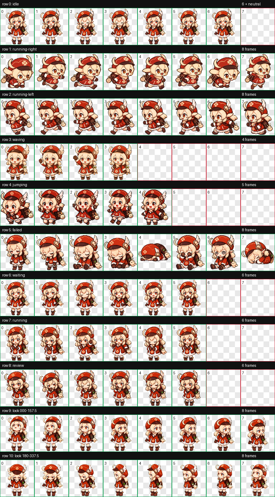

# Codex Pet Klee

A fan-made animated Codex pet inspired by a red clover spark-mage character design.



## GIF Previews

| Idle | Running Right | Running Left |
| --- | --- | --- |
|  |  |  |

| Waving | Jumping | Failed |
| --- | --- | --- |
|  |  |  |

| Waiting | Running | Review |
| --- | --- | --- |
|  |  |  |

## Install

Copy the pet folder into your Codex pets directory:

```bash
mkdir -p ~/.codex/pets/klee
cp pet/klee/pet.json ~/.codex/pets/klee/
cp pet/klee/spritesheet.webp ~/.codex/pets/klee/
```

Then restart Codex and choose the pet from the pet picker.

## Files

- `pet/klee/pet.json` - Codex pet manifest
- `pet/klee/spritesheet.webp` - animated pet spritesheet
- `gifs/*.gif` - per-state animated GIF previews
- `qa/contact-sheet.png` - generated QA contact sheet

## Notes

This is an unofficial fan-made asset for personal, non-commercial use. Character concepts, trademarks, and related rights belong to their respective owners.

No broad open-source license is granted for the underlying character design or IP.
